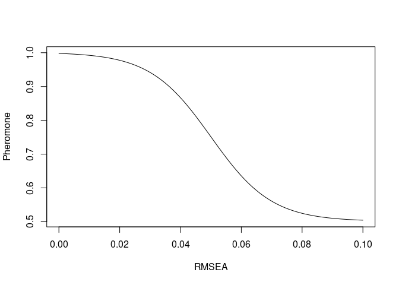
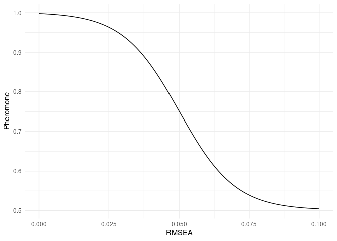
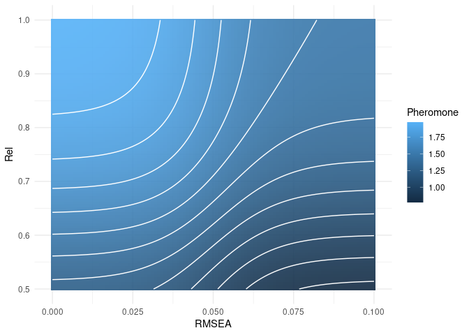

# README

This repository contains the current alpha-build of the STUART package
for R. The name suggests, what the package is made for: sub-tests using
algorithmic rummaging techniques. It is intended for the creation of
short-forms of questionnaires in a multitude of situations including
multiple facets, multiple groups, multiple measurement occasions, and
multiple sources of information. A full vignette is currently in the
works - for some of the theoretical and technical stuff you can [take a
look at the dissertation I
wrote](https://refubium.fu-berlin.de/handle/fub188/2951) - but this
readme will provide a short guide on using the package.

## Installation

The current stable version (0.9.1) is [available
CRAN](https://cran.r-project.org/package=stuart) and can be installed
using the usual approach:

    install.packages('stuart')

The current development version can be installed via the
`install_bitbucket()`-function included in the `devtools` package

    devtools::install_bitbucket('martscht/stuart/stuart', ref = 'develop')

If you omit `ref = 'develop'`, the function will install the main
branch, which is the one that can also be found on CRAN.

    library(stuart)

    ## Warning: This is a beta-build of stuart. Please report any bugs you encounter.

After installation the easiest way to get an overview of STUARTs
functions and capabilities is to use `?stuart` to open the package
help-file. You could also read the rest of this README for an
introduction and some examples.

## Prerequisites

The core idea behind STUART is to perform item-selection not based on
univariate properties of the items, but to instead use information about
the quality of a constructed solution for this task. In this sense, all
constructed solutions are viewed through the lense of confirmatory
factor analysis (CFA) which is used to relate the items to latent
constructs which are assumed to be the cause of observable behavior. To
perform CFA one of two additional software components is required:
either the [R-Package lavaan](http://lavaan.ugent.be/) or the
[commercial software Mplus](http://statmodel.com/). Because the choice
which of these to use is yours, neither of them were installed when
installing STUART, so you will need to do so manually, before being able
to use this package. If you intend to use Mplus, you will also need to
install the [R-Package
MplusAutomation](https://cran.r-project.org/web/packages/MplusAutomation/index.html),
so STUART can interface with the Mplus output.

**WARNING: While both software solutions are implemented, as of STUART
Version 0.9.0 it is highly recommended to use lavaan, if possible. This
is due to the current MplusAutomation-based implementation of using
Mplus, which is much slower than the current lavaan implementation (by
factors of around 20).**

## Features

The current STUART version (0.9.1) provides four approaches to item
selection, each in its own function:

-   `mmas()`, an adaptation of Stützle’s (1998) ℳ𝒜𝒳 − ℳℐ𝒩-Ant-System,
-   `gene()`, a basic genetic algorithm based on the ideas of Galán,
    Mengshoel, & Pinter (2013),
-   `bruteforce()`, the brute-force approach of simply trying all
    possible combinations, and
-   `randomsamples()`, a simple random sample of all possible
    combinations.

Before picking any of these, it is best to think about what it is that
you are trying to achieve and what kind of situation you are in. If you
are simply tring to determine what an average solution might look like
(in terms of scale properties) it is best to use `randomsamples()`. If
you are trying to find the best possible solution your next depends
primarily on the number of possible solutions. You can determine this
with `combinations()`. If the number is sufficiently small (or you are
willing wait sufficiently long) it is recommended to use `bruteforce()`,
because this guarantees that you will find the optimal solution in your
data. Which number passes as “sufficiently small” is up to you and
depends primarily on how long the estimation of a single CFA takes on
your computer. My ballpark recommendation is about 200 000 for a regular
CFA model with multiple facets. If one of these takes about a quarter
second to run, this should be done in about 2 hours on a decently
performing 8-core machine. If there are substantially more possible
combinations of items that could be tested in the process of item
selection, it is advisable to use either `mmas()` or `gene()`. The
`mmas()` approach has been thoroughly scrutinized ([by
me](https://refubium.fu-berlin.de/handle/fub188/2951)), while the
`gene()` approach is currently going through this process. Preliminary
results suggest that there is little difference in the performance of
these two approaches, so my current recommendation would be to use the
one you feel more comfortable with - Ant Colony Optimzation or Genetic
Algorithms. For both algorithms the presets of the parameters were
empirically derived from evaluation studies.

Because all of these approaches to item selection require some form of
empirical data, there is bound to be uncertainty associated with the
final solutions. To remedy the resulting insecurities about your
solution a bit, there are two approaches to validation:
`crossvalidate()`, which allows you to check the quality of the final
solution in a holdout sample by checking measurement invariance between
the initial (calibration) sample and the second (validation) sample and
`kfold()`, which performs the widespread k-Folds crossvalidation to
generate and validate multiple solutions. To help you with splitting
your data into these two sub-samples, STUART comes with the `holdout()`
function.

STUART features the possibility of using ordinal indicators - either as
the only type of items, or in combination with metric indicators. Thus,
you should be able to use STUART for item selection with almost any type
of questionnaire item-pool and have it generate the models, which
include your assumptions about measurement invariance across time,
groups, sources of information, and items automatically.

If you have not yet collected your own data, or simply want to play
around with the features of STUART, there are also two example datasets:
`fairplayer` and `sups`. The former includes multiple groups, multiple
occasions, multiple constructs, and multiple sources of information,
making it a perfect toy-example.

## Examples

In this section I will provide some small examples. These are not
exhaustive for all possible strategies which can be employed with
STUART, but should provide some insight into using its features. All
examples use the `fairplayer` dataset provided in the package:

    data(fairplayer)

This dataset contains information about 143 students on 142 variables.
The bulk of these variables are items regarding empathy (EM), social
intelligence (SI), and relational aggression (RA). Each item was
presented to the students themselves (s) as well as their teacher (t) at
three separate occasions (t1, t2, t3). Thus the names of the variables
in the dataset encode this information, for example `sRA03t2` is the
self-rated relational aggression on the third item at the second
measurement occasion.

The currently available examples are shown in the following table. If
there is a specific example you would like to see, please either contact
me directly or simply [file an
issue](https://bitbucket.org/martscht/stuart/issues?status=new&status=open).

<table>
<colgroup>
<col style="width: 35%" />
<col style="width: 9%" />
<col style="width: 11%" />
<col style="width: 13%" />
<col style="width: 11%" />
<col style="width: 12%" />
<col style="width: 6%" />
</colgroup>
<thead>
<tr class="header">
<th>Example</th>
<th>Approach</th>
<th>Multiple Facets</th>
<th>Multiple Occasions</th>
<th>Multiple Groups</th>
<th>Multiple Sources</th>
<th>Comments</th>
</tr>
</thead>
<tbody>
<tr class="odd">
<td><a href="#a-minimal-example">Minimal</a></td>
<td><code>bruteforce</code></td>
<td></td>
<td></td>
<td></td>
<td></td>
<td></td>
</tr>
<tr class="even">
<td><a href="#multiple-facets">Multiple Facets</a></td>
<td><code>gene</code></td>
<td>X</td>
<td></td>
<td></td>
<td></td>
<td></td>
</tr>
<tr class="odd">
<td><a href="#setting-anchor-items">Setting Anchors</a></td>
<td><code>mmas</code></td>
<td>X</td>
<td></td>
<td></td>
<td></td>
<td></td>
</tr>
<tr class="even">
<td><a href="#longitudinal-models">Longitudinal Models</a></td>
<td><code>bruteforce</code></td>
<td></td>
<td>X</td>
<td></td>
<td></td>
<td></td>
</tr>
<tr class="odd">
<td><a href="#crossvalidation">Crossvalidation</a></td>
<td><code>bruteforce</code></td>
<td></td>
<td></td>
<td></td>
<td></td>
<td></td>
</tr>
<tr class="even">
<td><a href="#k-folds-crossvalidation">k-Folds Crossvalidation</a></td>
<td><code>bruteforce</code></td>
<td></td>
<td>X</td>
<td></td>
<td></td>
<td></td>
</tr>
</tbody>
</table>

### A minimal example

In the `fairplayer` dataset, relational aggression was measured with
five items. Let’s say (as a minimal example) we want to find the optimal
three-item short version of this scale. For this we need to provide
STUART with some information about which items constitute the original
item-pool from which to choose. This information is stored in a `list`
and prodvided to any STUART-function as the `factor.structure` argument.
In this case:

    fs <- list(RA = c('sRA01t1', 'sRA02t1', 'sRA03t1', 'sRA04t1', 'sRA05t1'))

This list contains only a single vector (because we are looking at only
one facet at only occasion measured by only one source of information).
Each element of the list needs to be named, because this name is used in
the CFA models as the name of the latent variable. In this case I chose
“RA” to indicate that we’re looking at relational aggression. The
content of each element of the list is a character vector containing the
names of the items that constitute the item-pool for this latent
variable.

A quick glance at your scribbled notes from the intro to stats course
and some quick calculating tells you that there are 10 possible
combinations in this case, where we are drawing 3 items from a pool of 5
items (the order is irrelevant, because simple CFA models are covariance
equivalent across all orders of the indicators). This means, that this
consitutes an appropriate time to use the `bruteforce()` function:

    sel <- bruteforce(data = fairplayer, factor.structure = fs, capacity = 3)

    ## Loading required namespace: lavaan

    ## Loading required namespace: parallel

    ## There are 10 combinations that need to be tested.

    ## Generating all possible combinations.

    ## Running STUART with Brute-Force.

    ##   |                                                                              |                                                                      |   0%

    ## 
    ## Progressbars are not functional when utilizing multiple cores for bruteforce in Windows.

    ## 
    ## Search ended.

The `bruteforce()`-function (as do the other three item-selection
functions of STUART) requires a minimum of three arguments:

-   `data`: the dataset you are using,
-   `factor.structure`: the list assigning items to their facets, and
-   `capacity`: the number of items you want to select.

There are (many) more arguments you *can* use, but these three are
absolutely necessary. What this function should return is the three
items contained in what is deemed the optimal solution in accordance to
the preset objective:

    sel

    ## $RA
    ## [1] "sRA02t1" "sRA04t1" "sRA05t1"

This object is of the class `stuartOutput` and contains seven elements.
As with so many objects in R, `summary()` provides us with some more
information about what happened:

    summary(sel)

    ## Warning: This is a beta-build of stuart. Please report any bugs you encounter.

    ## SUMMARY OF ANALYSIS:
    ## 
    ## Analysis Type: bruteforce 
    ## Estimation Software: lavaan 
    ## Models Estimated: 10 
    ## Replications of final solution: 1 
    ## Time Required: 1.56 seconds
    ## 
    ## Optimization History:
    ##   run pheromone        chisq df pvalue rmsea         srmr      crel
    ## 1   1  1.867268 0.000000e+00  0     NA     0 3.304048e-09 0.7917421
    ## 2   2  1.892558 5.551115e-14  0     NA     0 5.063750e-09 0.8165856
    ## 9   9  1.905564 0.000000e+00  0     NA     0 1.512419e-08 0.8315434
    ## 
    ## Constructed Subtests:
    ## RA: sRA02t1 sRA04t1 sRA05t1

The summary provides us with information about the approach we used
(`bruteforce` in this case), the software that was used to estimate the
CFAs (`lavaan`, per default) the total number of models that was
estimated (`10`), the number of times the best solution was replicated
(when using `bruteforce` this should always be `1`), and the total time
it took to perform the selection. The next section is a table containing
the optimization history. This table shows the value a solution achieved
on the objective function (labeled `pheromone`, because of the packages
ACO roots) and the values these solutions had on all the components
included in the arguments of the objective function. Because we did not
provide a specific objective in this case, the preset was used. Take a
look at the preset:

    stuart:::objective.preset

    ## function (chisq, df, pvalue, rmsea, srmr, crel) 
    ## {
    ##     1/(1 + exp(-10 * (crel - 0.6))) + 0.5 * (1 - (1/(1 + exp(-100 * 
    ##         (rmsea - 0.05))))) + 0.5 * (1 - (1/(1 + exp(-100 * (srmr - 
    ##         0.06)))))
    ## }
    ## <bytecode: 0x00000000157dd9f8>
    ## <environment: namespace:stuart>

As you can see, per default the quality of a solution is determined by a
sum of logistic functions incorporating `crel` (composite reliability,
which is computed as McDonald’s *ω*), the RMSEA, and the SRMR. Because
our scale has one latent variable and only three items, model fit will
always be perfect, so it the objective simplified to the search for the
most reliable three-item scale.

Note that the optimization history contains only three solutions and not
all ten. That is because the optimization will report a solution only if
it is the best solution found at that point in the optimization process.
This means that the first solution will (almost) always be the first in
this list, while any subsequent solution will only be listed if it is
better than all those previously listed.

If you want to see the full list of solutions that were generated, one
of the seven elements of `stuartOutput`s is the `log`:

    sel$log

    ##    run pheromone        chisq df pvalue rmsea         srmr      crel
    ## 1    1  1.867268 0.000000e+00  0     NA     0 3.304048e-09 0.7917421
    ## 2    2  1.892558 5.551115e-14  0     NA     0 5.063750e-09 0.8165856
    ## 3    3  0.000000           NA NA     NA    NA           NA        NA
    ## 4    4  1.594282 1.006140e-13  0     NA     0 1.009375e-08 0.6400738
    ## 5    5  1.248296 0.000000e+00  0     NA     0 7.545426e-09 0.4916680
    ## 6    6  0.000000           NA NA     NA    NA           NA        NA
    ## 7    7  1.868069 0.000000e+00  0     NA     0 4.608557e-09 0.7924608
    ## 8    8  1.821704 0.000000e+00  0     NA     0 2.350829e-08 0.7559534
    ## 9    9  1.905564 0.000000e+00  0     NA     0 1.512419e-08 0.8315434
    ## 10  10  1.821323 5.551115e-14  0     NA     0 1.115460e-08 0.7556883

The solutions that contain `NA` on all variables were deemed
inadmissable solutions. This occurs when the CFA leads to errors in
estimation (e.g. non-convergence) or problems with estimated paramaters
(e.g. negative variances). Such solutions are excluded by default, but
the latter type of solutions can be included by using
`ignore.errors = TRUE`.

### Multiple Facets

The previous example was limited to a single facet. In this example, we
will take a look at something a bit more complex, which likely
constitutes the most common situation. In this example we will look at
empathy, relational aggression, and social intelligence simultaneously.
The example is a bit lacking, because these three constitute different
constructs and not different facets of a single construct, as would most
often be the case in scale construction.

As was the case in the previous example, the first thing we need to do
is set up the factor structure in a list that links items to their
facets:

    fs <- list(EM = names(fairplayer)[5:12],
      RA = names(fairplayer)[53:57],
      SI = names(fairplayer)[83:92])
    fs

    ## $EM
    ## [1] "sEM01t1" "sEM02t1" "sEM03t1" "sEM04t1" "sEM05t1" "sEM06t1" "sEM07t1"
    ## [8] "sEM08t1"
    ## 
    ## $RA
    ## [1] "sRA01t1" "sRA02t1" "sRA03t1" "sRA04t1" "sRA05t1"
    ## 
    ## $SI
    ##  [1] "sSI01t1" "sSI02t1" "sSI03t1" "sSI04t1" "sSI05t1" "sSI06t1" "sSI07t1"
    ##  [8] "sSI08t1" "sSI09t1" "sSI10t1"

In this case we use all items measured via self-reports at the first
measurement occasion. The `fs`-object is a list of 3, where each element
of the list represents a facet of the questionnaire. For example, the
first element is named `EM` to represent the assessment of Empathy and
contains the names of the 8 items that were used in this case.

Say we wanted 3 items for empathy, 3 items for relational, and 4 items
for social intelligence to have a ten-item questionnaire at the end of
item selection. This can be achieved by defining a list with the number
of items per facet. Of course, these numbers must be in the same order
as the factor structure, so they can be aligned.

    ni <- list(3, 3, 4)

To compute the number of possible combinations, we can use the
convenience function `combinations()`:

    combinations(fairplayer, fs, ni)

    ## [1] 117600

In a real-world setting I would recommend running `bruteforce()` with
this number of possible combinations. However, because this is an
example, we will try something different than in the last example, by
using the genetic algorithm that is implemented in `gene()`.

Just like in the previous example, only three arguments are strictly
necessary: the dataset, the factor structure, and the number of items.
To generate reproducible results we can also use the additional argument
`seed` to provide a random seed:

    sel <- gene(fairplayer, fs, ni, seed = 35355)

    Running STUART with Genetic Algorithm.

      |==============================================                                   |  55%

    Search ended. Algorithm converged.

An important piece of information here is that the algorithm converged.
In this approach this means that the quality of the best solutions per
generation showed minimal variation after some time. The alternative
would have been for the algorithm to abort after 128 generations (per
default), if convergence would not have been reached by then. Again, let
us take a look at the summary to view the results in detail:

    summary(sel)

    ## Warning: This is a beta-build of stuart. Please report any bugs you encounter.

    ## SUMMARY OF ANALYSIS:
    ## 
    ## Analysis Type: gene 
    ## Estimation Software: lavaan 
    ## Models Estimated: 4544 
    ## Replications of final solution: 2307 
    ## Time Required: 42.297 seconds
    ## 
    ## Optimization History:
    ##     run ind pheromone    chisq df       pvalue      rmsea       srmr      crel
    ## 1     1   1 0.9714857 67.74143 32 0.0002288957 0.09415116 0.07756107 0.8110008
    ## 3     1   3 1.0069370 63.16413 32 0.0008310642 0.08791586 0.07190684 0.7986173
    ## 5     1   5 1.4117306 43.02228 32 0.0923156853 0.05228479 0.05556138 0.8046341
    ## 12    1  12 1.7310307 28.20980 32 0.6589455342 0.00000000 0.04848657 0.7770333
    ## 51    1  51 1.7379274 30.93543 32 0.5202934365 0.00000000 0.04694889 0.7718433
    ## 73    2   9 1.7526648 23.94351 32 0.8464530294 0.00000000 0.04651070 0.7807289
    ## 111   2  47 1.7914778 28.90732 32 0.6238659074 0.00000000 0.04620266 0.8146595
    ## 149   3  21 1.8175800 26.60508 32 0.7362439152 0.00000000 0.04508053 0.8347574
    ## 187   3  59 1.8200085 28.65614 32 0.6365675485 0.00000000 0.04319827 0.8218417
    ## 300   5  44 1.8377925 23.35948 32 0.8666563405 0.00000000 0.03650133 0.8037487
    ## 324   6   4 1.8404997 28.88624 32 0.6249343199 0.00000000 0.04410038 0.8564487
    ## 352   6  32 1.8562645 19.46001 32 0.9600125185 0.00000000 0.03740006 0.8275841
    ## 395   7  11 1.8579455 17.42704 32 0.9830191354 0.00000000 0.03811721 0.8334521
    ## 
    ## Constructed Subtests:
    ## EM: sEM01t1 sEM02t1 sEM07t1
    ## RA: sRA02t1 sRA04t1 sRA05t1
    ## SI: sSI01t1 sSI02t1 sSI07t1 sSI08t1

As you can see, the search took 42.297 seconds and estimated 4544
models. As is bound to happen in this specific genetic approach, the
final solution was replicated quite often. Replications of solutions are
not estimated again, which is why you should have been able to observe
the search process speeding up towards the end. The final solution
(again, in terms of the preset objective function, which you can view
via `stuart:::objective.preset`) had a pheromone of 1.858 stemming from
an RMSEA of 0 and a composite reliability of 0.833.

You can, of course, also take a more detailed look at the final
soultion. Per default, lavaan is used for CFA estimation, so the lavaan
object of the final model is return in the `stuartOutput` object,
specifically in the slot `final`. If you want to take an in-depth look
at the lavaan results of this model, you can simply use the `summary`
method implemented in lavaan:

    lavaan::summary(sel$final)

    ## lavaan 0.6-8 ended normally after 52 iterations
    ## 
    ##   Estimator                                         ML
    ##   Optimization method                           NLMINB
    ##   Number of model parameters                        33
    ##                                                       
    ##                                                   Used       Total
    ##   Number of observations                           126         143
    ##   Number of missing patterns                         9            
    ##                                                                   
    ## Model Test User Model:
    ##                                                       
    ##   Test statistic                                17.427
    ##   Degrees of freedom                                32
    ##   P-value (Chi-square)                           0.983
    ## 
    ## Parameter Estimates:
    ## 
    ##   Standard errors                             Standard
    ##   Information                                 Observed
    ##   Observed information based on                Hessian
    ## 
    ## Latent Variables:
    ##                    Estimate  Std.Err  z-value  P(>|z|)
    ##   EM =~                                               
    ##     sEM01t1 (l111)    1.000                           
    ##     sEM02t1 (l211)    1.786    0.300    5.957    0.000
    ##     sEM07t1 (l711)    1.156    0.211    5.480    0.000
    ##   RA =~                                               
    ##     sRA02t1 (l221)    1.000                           
    ##     sRA04t1 (l421)    1.578    0.242    6.529    0.000
    ##     sRA05t1 (l521)    0.666    0.104    6.411    0.000
    ##   SI =~                                               
    ##     sSI01t1 (l131)    1.000                           
    ##     sSI02t1 (l231)    0.936    0.209    4.470    0.000
    ##     sSI07t1 (l731)    1.029    0.235    4.369    0.000
    ##     sSI08t1 (l831)    0.990    0.240    4.124    0.000
    ## 
    ## Covariances:
    ##                    Estimate  Std.Err  z-value  P(>|z|)
    ##   EM ~~                                               
    ##     RA                0.082    0.040    2.053    0.040
    ##     SI                0.191    0.055    3.460    0.001
    ##   RA ~~                                               
    ##     SI                0.041    0.046    0.887    0.375
    ## 
    ## Intercepts:
    ##                    Estimate  Std.Err  z-value  P(>|z|)
    ##    .sEM01t1 (a111)    4.148    0.076   54.685    0.000
    ##    .sEM02t1 (a211)    3.937    0.086   45.759    0.000
    ##    .sEM07t1 (a711)    3.822    0.086   44.216    0.000
    ##    .sRA02t1 (a221)    1.693    0.084   20.252    0.000
    ##    .sRA04t1 (a421)    2.260    0.112   20.190    0.000
    ##    .sRA05t1 (a521)    1.422    0.069   20.472    0.000
    ##    .sSI01t1 (a131)    3.747    0.084   44.715    0.000
    ##    .sSI02t1 (a231)    4.007    0.071   56.151    0.000
    ##    .sSI07t1 (a731)    3.930    0.085   46.228    0.000
    ##    .sSI08t1 (a831)    2.875    0.090   31.820    0.000
    ##     EM                0.000                           
    ##     RA                0.000                           
    ##     SI                0.000                           
    ## 
    ## Variances:
    ##                    Estimate  Std.Err  z-value  P(>|z|)
    ##    .sEM01t1 (e111)    0.468    0.067    6.939    0.000
    ##    .sEM02t1 (e211)    0.126    0.089    1.406    0.160
    ##    .sEM07t1 (e711)    0.598    0.085    7.047    0.000
    ##    .sRA02t1 (e221)    0.367    0.079    4.661    0.000
    ##    .sRA04t1 (e421)    0.308    0.161    1.912    0.056
    ##    .sRA05t1 (e521)    0.377    0.055    6.789    0.000
    ##    .sSI01t1 (e131)    0.596    0.092    6.495    0.000
    ##    .sSI02t1 (e231)    0.378    0.064    5.880    0.000
    ##    .sSI07t1 (e731)    0.588    0.093    6.322    0.000
    ##    .sSI08t1 (e831)    0.737    0.109    6.781    0.000
    ##     EM                0.253    0.077    3.305    0.001
    ##     RA                0.503    0.121    4.169    0.000
    ##     SI                0.283    0.097    2.914    0.004

As you can see, a lot of parameters are labeled automatically. This is
because these labels are used to implement invariance assumptions in
more complex situations.

### Setting Anchor Items

In many situations, specific items are so central to the definition of a
construct that they must be included in the final questionnaire. In such
cases it is best to select items which fit around these anchor items.
When using the `mmas()` approach to item selection this can be handled
via *heuristics*. In the ACO approach underlying the `mmas()` function
the probability of selecting an item when a potential solution is
constructed is dependent on two factors: the pheromone (i.e. the extent
to which an item has proven itself useful in prior solutions) and the
heuristic information (i.e. information that is provided before
beginning the construction of solutions). Per default, each item has its
own pheromone and its own heuristic information - this is called *node
localization*. A [later example]() shows the alternative - *arc
localization* - but let us focus on the default case for now. To
incorporate anchor items, we need to provide heuristic information that
makes the selection of these items basically certain.

Let us look at a situation in which we are interested in selecting items
for three separate facets of the same questionnaire. As described in
[Example 2](#ex2_gene) this requires a factor structure with three
elements linking items to their respective facets:

    fs <- list(EM = names(fairplayer)[5:12],
      RA = names(fairplayer)[53:57],
      SI = names(fairplayer)[83:92])
    fs

    ## $EM
    ## [1] "sEM01t1" "sEM02t1" "sEM03t1" "sEM04t1" "sEM05t1" "sEM06t1" "sEM07t1"
    ## [8] "sEM08t1"
    ## 
    ## $RA
    ## [1] "sRA01t1" "sRA02t1" "sRA03t1" "sRA04t1" "sRA05t1"
    ## 
    ## $SI
    ##  [1] "sSI01t1" "sSI02t1" "sSI03t1" "sSI04t1" "sSI05t1" "sSI06t1" "sSI07t1"
    ##  [8] "sSI08t1" "sSI09t1" "sSI10t1"

Assuming we want to select three items for each of the facets, we can
compute the number of possible combinations:

    combinations(fairplayer, fs, 3)

    ## [1] 67200

To use the `mmas()` function it is necessary to provide values to the
arguments `data`, `factor.structure`, and `capacity` - much like in the
previous examples. To use heuristics, we also need to provide those to
the `heuristics` argument. These heuristics need to have a specific
format for `mmas()` to understand what is happening, but thankfully
there is a `heuristics()` function, which generates a preset in the
correct format:

    heu <- heuristics(fairplayer, fs, 3)
    heu

    ## $EM
    ##      sEM01t1 sEM02t1 sEM03t1 sEM04t1 sEM05t1 sEM06t1 sEM07t1 sEM08t1
    ## [1,]       1       1       1       1       1       1       1       1
    ## 
    ## $RA
    ##      sRA01t1 sRA02t1 sRA03t1 sRA04t1 sRA05t1
    ## [1,]       1       1       1       1       1
    ## 
    ## $SI
    ##      sSI01t1 sSI02t1 sSI03t1 sSI04t1 sSI05t1 sSI06t1 sSI07t1 sSI08t1 sSI09t1
    ## [1,]       1       1       1       1       1       1       1       1       1
    ##      sSI10t1
    ## [1,]       1
    ## 
    ## attr(,"class")
    ## [1] "stuartHeuristics"
    ## attr(,"localization")
    ## [1] "nodes"

This object is of the class `stuartHeuristics`. As you can see, every
item has `1` as its heuristic information. This information is
multiplied with the items pheromone to generate the selection
probability, so `1` means the selection procedure is based exclusively
on pheromones. Using a `0` would exclude an item from the selection
procedure completely (though it would probably be easier to simply not
include it in the first place). Any number larger than 1 makes the
selection of the item more probable than it would be based purely on its
merit encoded in the pheromone. Thus, to use anchor items we need to set
the heuristic information of those items to a very large number.

Let’s say we want item 3 to be an anchor for empathy, we don’t want any
anchors for relational aggression, and we want items 1 and 8 as anchors
for social intelligence. In this case we simply overwrite the default
heuristic information with a very large number, say 1 million:

    heu$EM[3] <- 1e+6
    heu$SI[1] <- heu$SI[8] <- 1e+6
    heu

    ## $EM
    ##      sEM01t1 sEM02t1 sEM03t1 sEM04t1 sEM05t1 sEM06t1 sEM07t1 sEM08t1
    ## [1,]       1       1   1e+06       1       1       1       1       1
    ## 
    ## $RA
    ##      sRA01t1 sRA02t1 sRA03t1 sRA04t1 sRA05t1
    ## [1,]       1       1       1       1       1
    ## 
    ## $SI
    ##      sSI01t1 sSI02t1 sSI03t1 sSI04t1 sSI05t1 sSI06t1 sSI07t1 sSI08t1 sSI09t1
    ## [1,]   1e+06       1       1       1       1       1       1   1e+06       1
    ##      sSI10t1
    ## [1,]       1
    ## 
    ## attr(,"class")
    ## [1] "stuartHeuristics"
    ## attr(,"localization")
    ## [1] "nodes"

This makes those items 1 million times more likely to be selected than
items with equal pheromone. Because these items are always selected,
their pheromone cannot evaporate, thus (practically) guaranteeing that
these items will always be included. To run the `mmas()` algorithm we
then need to include these updated heuristics in the function:

    sel <- mmas(fairplayer, fs, 3, heuristics = heu)

    Running STUART with MMAS.

      |                                                                                       |   0%
    Global best no. 1 found. Colony counter reset.

    Global best no. 2 found. Colony counter reset.
      |=====                                                                                  |   6%
    Global best no. 3 found. Colony counter reset.
      |==                                                                                     |   3%
    Global best no. 4 found. Colony counter reset.
      |====                                                                                   |   4%
    Global best no. 5 found. Colony counter reset.
      |===                                                                                    |   4%
    Global best no. 6 found. Colony counter reset.
      |=======================================================================================| 100%

    Search ended. Maximum number of colonies exceeded.

In this case the algorithm did not converge, but reached its abort
criterion. This is not necessarily a bad thing and we will look at
potential reasons in a [later example](). For now, let’s take a look at
the solution for this case:

    summary(sel)

    ## Warning: This is a beta-build of stuart. Please report any bugs you encounter.

    ## SUMMARY OF ANALYSIS:
    ## 
    ## Analysis Type: mmas 
    ## Estimation Software: lavaan 
    ## Models Estimated: 4816 
    ## Replications of final solution: 408 
    ## Time Required: 88.941 seconds
    ## 
    ## Optimization History:
    ##     run ant pheromone    chisq df    pvalue      rmsea       srmr      crel
    ## 1     1   1  1.489002 28.72482 24 0.2306596 0.03952770 0.05713651 0.7609413
    ## 3     1   3  1.617417 21.68898 24 0.5978243 0.00000000 0.05026616 0.7141021
    ## 6     1   6  1.644714 24.43025 24 0.4372274 0.01192804 0.05293613 0.7521617
    ## 9     1   9  1.707683 22.14288 24 0.5707388 0.00000000 0.04856682 0.7599045
    ## 14    1  14  1.723117 19.47913 24 0.7259783 0.00000000 0.04430688 0.7467127
    ## 17    2   1  1.810053 18.82107 24 0.7614633 0.00000000 0.03818777 0.7849972
    ## 259  17   3  1.817149 17.83216 24 0.8110735 0.00000000 0.03495550 0.7800985
    ## 373  24   5  1.817977 22.69421 24 0.5379041 0.00000000 0.04050615 0.8027304
    ## 549  35   5  1.829930 20.92041 24 0.6434159 0.00000000 0.04098934 0.8178153
    ## 715  45  11  1.840193 22.63275 24 0.5415548 0.00000000 0.03917303 0.8185441
    ## 
    ## Constructed Subtests:
    ## EM: sEM02t1 sEM03t1 sEM07t1
    ## RA: sRA02t1 sRA04t1 sRA05t1
    ## SI: sSI01t1 sSI02t1 sSI08t1

As you can see, the anchored items are all included in the final
selection. In my case a total of 4816 models were estimated amounting to
a runtime of close to 90 seconds. The final solution also seems to work
quite nicely in terms of the objective: the RMSEA is 0, the SRMR is
below any reasonable threshold for model fit and the composite
reliability is quite high for such a short measure.

### Longitudinal Models

Longitudinal studies are a mainstay in many areas of social sciences.
Such studies have specific requirements for the questionnaires that are
used. The one that is maybe mentioned most often is measurement
invariance - properties of the measurement instrument which are
prerequisites for making certain types of statements about change and
stability of constructs over time. STUART allows for the selection from
item-pools which were assessed at multiple occasions to optimize the
final scale under appropriate assumptions of measurement invariance. To
this end four, successively more restrictive, types of measurement
invariance are implemented:

<table>
<colgroup>
<col style="width: 11%" />
<col style="width: 88%" />
</colgroup>
<thead>
<tr class="header">
<th>Level</th>
<th>Constraint</th>
</tr>
</thead>
<tbody>
<tr class="odd">
<td><code>configural</code></td>
<td>The same items measure the same constructs over time</td>
</tr>
<tr class="even">
<td><code>weak</code></td>
<td>Factor loadings are the same over time (<em>λ</em><em>i</em><em>t</em> = <em>λ</em><em>i</em><em>t</em>′)</td>
</tr>
<tr class="odd">
<td><code>strong</code></td>
<td>Intercepts of manifest variables are the same over time (<em>α</em><em>i</em><em>t</em> = <em>α</em><em>i</em><em>t</em>′)</td>
</tr>
<tr class="even">
<td><code>strict</code></td>
<td>Residual variances of manifest variables are the same over time (<em>v</em><em>a</em><em>r</em>(<em>ϵ</em><em>i</em><em>t</em>) = <em>v</em><em>a</em><em>r</em>(<em>ϵ</em><em>i</em><em>t</em>′))</td>
</tr>
</tbody>
</table>

These four levels are used not only for longitudinal models, but also to
determine invariance across groups and different sources of information.
For longitudinal measures strict measurement invariance is the default
in all STUART functions, but it can be set to any of the four levels
using the `xxx.invariance` arguments. If you want to incorporate weak
longitudinal measurement invariance, you can do so by setting
`long.invariance = 'weak'` in the function you are using for
item-selection.

In STUART longitudinal models are simple to implement. The
`factor.structure` is provided in the same way as shown in previous
examples. Here, let us select a three-item scale for the longitudinal
self-assessment of social intelligence. For this, we have three
occasions at which social intelligence was measured. The corresponding
items are named with `sSI` (self-reported social intelligence) and the
final `t1`, `t2`, or `t3` denotes the measurement occasion. In line with
the factor structure above we can assign the names of these items to
three separate factors:

    data(fairplayer)
    fs <- list(si1 = names(fairplayer)[83:92],
      si2 = names(fairplayer)[93:102],
      si3 = names(fairplayer)[103:112])

For STUART to know that these three factors are repeated measures of the
same construct, we need to provide a new list.

    repe <- list(si = c('si1', 'si2', 'si3'))

In this list a general construct (`si`) is an element of the list and
the names of the factors defined in the factor structure are contained
in a vector in this element. This list needs to be passed to the
`repeated.measures`-argument of any of the STUART functions. Using this
list for repeated measures guarantees that the same items are selected
for the factors which are named in the same element of the list. We can
quickly check this, using the `combinations` function:

    combinations(fairplayer, fs, 3,
      repeated.measures = repe)

    ## [1] 120

When the items are selected independently for each facet, the number of
possible combinations is quite a bit higher:

    combinations(fairplayer, fs, 3)

    ## [1] 1728000

Because the number of combinations for the longitudinal model is quite
low, we can use the `bruteforce` approach (but the same procedure to
incorporate longitudinal measurements can be used for `mmas`, `gene`,
and `randomsamples`):

    sel <- bruteforce(fairplayer, fs, 3,
      repeated.measures = repe)

    ## There are 120 combinations that need to be tested.

    ## Generating all possible combinations.

    ## Running STUART with Brute-Force.

    ##   |                                                                              |                                                                      |   0%

    ## 
    ## Progressbars are not functional when utilizing multiple cores for bruteforce in Windows.

    ## 
    ## Search ended.

The resulting object is structurally the same as we have seen in
previous examples. When printing the results, the selected items are
returned:

    sel

    ## $si1
    ## [1] "sSI08t1" "sSI09t1" "sSI10t1"
    ## 
    ## $si2
    ## [1] "sSI08t2" "sSI09t2" "sSI10t2"
    ## 
    ## $si3
    ## [1] "sSI08t3" "sSI09t3" "sSI10t3"

As you can see, the same items are selected for each occasion (because
we deemed the three factors are repeated measures of the same facet).
The `summary` again provides some more detail:

    summary(sel)

    ## Warning: This is a beta-build of stuart. Please report any bugs you encounter.

    ## SUMMARY OF ANALYSIS:
    ## 
    ## Analysis Type: bruteforce 
    ## Estimation Software: lavaan 
    ## Models Estimated: 120 
    ## Replications of final solution: 1 
    ## Time Required: 4.39 seconds
    ## 
    ## Optimization History:
    ##     run pheromone     chisq df       pvalue      rmsea       srmr      crel
    ## 1     1 0.6592997 136.96544 38 4.187761e-13 0.14046335 0.11294034 0.6648811
    ## 3     3 0.7207495 154.93880 38 4.440892e-16 0.15268647 0.11210919 0.6934655
    ## 10   10 0.7784437  84.20447 38 2.381714e-05 0.09597613 0.08112324 0.6942001
    ## 22   22 0.8927102  84.61389 38 2.111130e-05 0.09640042 0.07752741 0.7476721
    ## 114 114 0.9486505  60.82243 38 1.078677e-02 0.06745314 0.07076123 0.7083791
    ## 120 120 1.3178903  55.05968 38 3.617863e-02 0.05831854 0.05621054 0.7896142
    ## 
    ## Constructed Subtests:
    ## si1: sSI08t1 sSI09t1 sSI10t1
    ## si2: sSI08t2 sSI09t2 sSI10t2
    ## si3: sSI08t3 sSI09t3 sSI10t3

In this case, the final selection is sensibly made on the basis of the
quality of the final model which incorporates the supposed measurement
invariance. If you, like so many reviewers, would rather make the
decision based on the model comparison of different levels of
measurement invariance, you can do so by using the
`comparisons`-argument. For this longitudinal model (with the preset of
strict measurement invariance) it would look like this:

    sel <- bruteforce(fairplayer, fs, 3,
      repeated.measures = repe,
      comparisons = 'long')

What will happen is that for each solution two models are estimated: the
one assuming the invariance level provided via `long.invariance` and the
one that is one step less restrictive. The preset objective function
will then be based on the results of model comparisons, but you can
change this according to your preferences. The `summary` then also
contains the model comparisons (identified by the prefix `delta.`) in
addition to the model fit of the final models:

    ## Warning: This is a beta-build of stuart. Please report any bugs you encounter.

    ## SUMMARY OF ANALYSIS:
    ## 
    ## Analysis Type: bruteforce 
    ## Estimation Software: lavaan 
    ## Models Estimated: 120 
    ## Replications of final solution: 1 
    ## Time Required: 6.929 seconds
    ## 
    ## Optimization History:
    ##     run pheromone     chisq df       pvalue      rmsea       srmr       cfi
    ## 1     1  1.740656 136.96544 38 4.187761e-13 0.14046335 0.11294034 0.7643188
    ## 10   10  1.807309  84.20447 38 2.381714e-05 0.09597613 0.08112324 0.8715099
    ## 22   22  1.978632  84.61389 38 2.111130e-05 0.09640042 0.07752741 0.8969178
    ## 104 104  2.065119  83.00685 38 3.381589e-05 0.09472411 0.07540889 0.8947231
    ## 120 120  2.343020  55.05968 38 3.617863e-02 0.05831854 0.05621054 0.9680228
    ##          crel delta.chisq delta.df delta.pvalue  delta.rmsea  delta.srmr
    ## 1   0.6648811   10.316105        6   0.11195591 -0.009228044 0.004154593
    ## 10  0.6942001    4.546842        6   0.60309902 -0.010243371 0.003745954
    ## 22  0.7476721   12.367680        6   0.05425136 -0.001210985 0.008186306
    ## 104 0.6917748   11.495381        6   0.07422073 -0.001992179 0.003256856
    ## 120 0.7896142    3.530982        6   0.73984323 -0.009676097 0.001404970
    ##       delta.cfi  delta.crel
    ## 1   -0.01027859 0.043902722
    ## 10   0.00404109 0.025414268
    ## 22  -0.01408152 0.069547526
    ## 104 -0.01285442 0.076155906
    ## 120  0.00462801 0.009307522
    ## 
    ## Constructed Subtests:
    ## si1: sSI08t1 sSI09t1 sSI10t1
    ## si2: sSI08t2 sSI09t2 sSI10t2
    ## si3: sSI08t3 sSI09t3 sSI10t3

### Crossvalidation

In any type of scale construction validation is a key concept. The same
is true for many algorithm-driven analyses, where *k*-Folds
crossvalidation is extremely popular. In STUART there are two functions
which can aide the crossvalidation of solutions: `holdout()` which
splits a dataset into two subsamples and `crossvalidate()` which applies
the solution found by one of the four approaches and uses multiple-group
SEM to investigate, whether the solution holds in the holdout-sample.

Take the [minimal example](#a-minimal-example), where we searched for
three items out of the five items meant to assess relational aggression
using `bruteforce()`. Prior to this search we can use `holdout()` to
split the sample into two subsamples:

    cv <- holdout(fairplayer, seed = 35355)
    names(cv)

    ## [1] "calibrate" "validate"

    sapply(cv, nrow)

    ## calibrate  validate 
    ##        72        71

Per default `holdout()` will split the sample into two evenly sized
halves called `calibrate` and `validate`. As the names suggest, the
first subsample is used for the item selection procedure, while the
second is used as the validation sample. You can change the
split-proportions using the `prop` argument and providing a variable
name to `grouping` will ensure that the proportions of the groups are
evenly distributed across the two subsamples.

With the `stuartHoldout` object, the four types of item selection will
be performed only on the `calibrate` subsample. The rest is analogous to
all other usages of the STUART functionalities:

    fs <- list(RA = c('sRA01t1', 'sRA02t1', 'sRA03t1', 'sRA04t1', 'sRA05t1'))
    sel <- bruteforce(cv, fs, 3)

    ## There are 10 combinations that need to be tested.

    ## Generating all possible combinations.

    ## Running STUART with Brute-Force.

    ##   |                                                                              |                                                                      |   0%

    ## 
    ## Progressbars are not functional when utilizing multiple cores for bruteforce in Windows.

    ## 
    ## Search ended.

The summary object also looks the same:

    summary(sel)

    ## Warning: This is a beta-build of stuart. Please report any bugs you encounter.

    ## SUMMARY OF ANALYSIS:
    ## 
    ## Analysis Type: bruteforce 
    ## Estimation Software: lavaan 
    ## Models Estimated: 10 
    ## Replications of final solution: 1 
    ## Time Required: 1.21 seconds
    ## 
    ## Optimization History:
    ##   run pheromone        chisq df pvalue rmsea         srmr      crel
    ## 1   1  1.804314 0.000000e+00  0     NA     0 4.491913e-09 0.7442857
    ## 2   2  1.887900 1.538769e-13  0     NA     0 2.444315e-08 0.8116355
    ## 9   9  1.916549 0.000000e+00  0     NA     0 1.381929e-08 0.8457823
    ## 
    ## Constructed Subtests:
    ## RA: sRA02t1 sRA04t1 sRA05t1

Now, if you want to check the measurement invariance across the two
samples, you can simply use `crossvalidate()`:

    crossvalidate(sel, cv)

    ##            pheromone        chisq df    pvalue rmsea         srmr      crel
    ## configural  1.907973 5.175860e-13  0        NA     0 9.553911e-08 0.8345252
    ## weak        1.872723 1.609005e+00  2 0.4473104     0 3.401333e-02 0.8321989
    ## strong      1.787365 2.466910e+00  5 0.7814700     0 4.851177e-02 0.8326695
    ## strict      1.828272 3.330870e+00  8 0.9119122     0 4.318741e-02 0.8314649
    ##            Chisq diff Df diff Pr(>Chisq)
    ## configural         NA      NA         NA
    ## weak        1.6090051       2  0.4473104
    ## strong      0.8579050       3  0.8355725
    ## strict      0.8639601       3  0.8341152

The function automatically checks the four standard measurement
invariance assumptions across the two samples. In this case invariance
assumptions hold across the two subsamples - due to the extremely small
sample size in both samples, these results are still not really
convincing. If you did not use `holdout()` but simply have two datasets,
you can use the same approach but simply provide two dataframes to the
function.

### Groups

Since we already had enough fun with the *fairplayer* data, we now
switch to something new and hopefully just as exciting. The *sups* data
is a dataset which originates from a scale for Supervisor Support with
two subscales: *career promotion* and *feedback and goal setting*.

For having all necessary data available, we simply need to load the
dataset, name the different factors and decide how many items of both
facets our hopefully perfect questionnaire should include.

    data("sups")
    fs_s <- list(CP = names(sups)[2:13],
               FGS = names(sups)[14:20])
    ni_s <- list(4, 4)

For the sole purpose of showing the `bruteforce`, `gene` or
`mmas`-approach of running stuart for the item selection while having
different groups, we manually added a new variable to the *sups*
dataframe named *groups*. Please note that even though this example is
designed to only present two different groups, it is possible to run
stuart with up to as many groups as you like, given a sufficient sample
size.

    set.seed(203)
    sups$groups <- sample(c(0, 1), nrow(sups), replace = T)

To include the group in our item selection process, we simply add the
argument `grouping`. Since our created variable is named *groups*, the
new argument thus used is “grouping = ‘groups’”.

    sel <- gene(sups, fs_s, ni_s, grouping = 'groups', seed = 302)

    Running STUART with Genetic Algorithm.

      |==============                                               |  22%
    Reinitialized population. Generation counter reset.
      |=============================================================| 100%

    Search ended. Maximum number of generations exceeded.

Our summary now looks like this:

    summary(sel)

    ## Warning: This is a beta-build of stuart. Please report any bugs you encounter.

    ## SUMMARY OF ANALYSIS:
    ## 
    ## Analysis Type: gene 
    ## Estimation Software: lavaan 
    ## Models Estimated: 19008 
    ## Replications of final solution: 3491 
    ## Maximum number of generations exceeded. 
    ## Time Required: 162.9 seconds
    ## 
    ## Optimization History:
    ##      run ind pheromone     chisq df       pvalue      rmsea       srmr
    ## 1      1   1  1.192026 137.48838 58 2.107028e-08 0.09858896 0.06160535
    ## 3      1   3  1.192220 127.31373 58 4.175767e-07 0.09206320 0.06157309
    ## 4      1   4  1.290714  95.52715 58 1.397131e-03 0.06774063 0.05857789
    ## 5      1   5  1.300044 135.53279 58 3.785533e-08 0.09736865 0.05278934
    ## 8      1   8  1.300952 108.58139 58 6.453117e-05 0.07864513 0.05437516
    ## 12     1  12  1.318658 137.14415 58 2.336848e-08 0.09837525 0.05107773
    ## 13     1  13  1.623122  74.83782 58 6.758536e-02 0.04537528 0.05026510
    ## 186    3  58  1.801626  66.61809 58 2.047221e-01 0.03246250 0.04326526
    ## 263    5   7  1.851866  62.96276 58 3.051033e-01 0.02463419 0.04151548
    ## 265    5   9  1.889660  57.42055 58 4.968008e-01 0.00000000 0.04052349
    ## 1625  26  25  1.895559  59.76365 58 4.114123e-01 0.01468528 0.03777945
    ##           crel
    ## 1    0.9132168
    ## 3    0.9043532
    ## 4    0.8953928
    ## 5    0.9159412
    ## 8    0.9066046
    ## 12   0.9179373
    ## 13   0.9018754
    ## 186  0.9041031
    ## 263  0.9091969
    ## 265  0.9064669
    ## 1625 0.9143906
    ## 
    ## Constructed Subtests:
    ## CP: SupS5 SupS8 SupS11 SupS12
    ## FGS: SupS14 SupS16 SupS17 SupS18

As the summary shows, stuarts’ *gene*-approach selects items 4, 5 6 and
12 for the facet of *career promotion*, while also selecting items 13,
15, 16 and 18 for the facet *feedback and goal setting*.

### Better Groups

Another addition to this selection process is the inclusion of the
invariance between the items. Stuart enables us with the argument
`group.invariance` to choose between four different restriction types –
*configural*, *weak*, *strong* and *strict*. To include the type of
invariance our selected items should guarantee, stuart grants us the
possibility of choosing between the 4 different invariances by adding
the argument `group.invariance = 'XXX'` to our command. Please note that
the result of the item selection will differ when choosing different
types of invariances in your argument. If this argument is left out, the
default will be set to *strict*.

    sel <- gene(sups, fs_s, ni_s, grouping = 'groups', group.invariance = 'weak', seed = 302)

    Running STUART with Genetic Algorithm.

      |==========                                                   |  17%
    Reinitialized population. Generation counter reset.
      |=============================================================| 100%

    Search ended. Maximum number of generations exceeded.

Our new summary now looks like this:

    summary(sel)

    ## Warning: This is a beta-build of stuart. Please report any bugs you encounter.

    ## SUMMARY OF ANALYSIS:
    ## 
    ## Analysis Type: gene 
    ## Estimation Software: lavaan 
    ## Models Estimated: 17792 
    ## Replications of final solution: 359 
    ## Maximum number of generations exceeded. 
    ## Time Required: 208.6 seconds
    ## 
    ## Optimization History:
    ##       run ind pheromone     chisq df       pvalue      rmsea       srmr
    ## 1       1   1  1.198803 131.64740 44 1.130935e-10 0.11885942 0.06079084
    ## 3       1   3  1.261587 110.92219 44 1.068115e-07 0.10386021 0.05554344
    ## 4       1   4  1.321011  81.97093 44 4.467449e-04 0.07823295 0.05228105
    ## 5       1   5  1.326799 128.95103 44 2.845961e-10 0.11701686 0.04984777
    ## 8       1   8  1.332734  95.06880 44 1.278510e-05 0.09072812 0.04969069
    ## 12      1  12  1.335739 129.91933 44 2.045164e-10 0.11768186 0.04899147
    ## 13      1  13  1.453780  68.31163 44 1.087675e-02 0.06259954 0.04736972
    ## 45      1  45  1.455041  65.16693 44 2.068546e-02 0.05841078 0.05150834
    ## 73      2   9  1.458972  71.94490 44 4.941842e-03 0.06711434 0.04290729
    ## 124     2  60  1.671372  56.76982 44 9.379399e-02 0.04536872 0.04543411
    ## 274     5  18  1.735311  55.74626 44 1.102713e-01 0.04351249 0.03794522
    ## 294     5  38  1.838212  50.37167 44 2.359842e-01 0.03204725 0.03788274
    ## 1478   24   6  1.855980  49.67917 44 2.573405e-01 0.03025564 0.03575079
    ## 10351 162  47  1.862460  47.96162 44 3.152978e-01 0.02526972 0.03964582
    ##            crel
    ## 1     0.9131474
    ## 3     0.9043584
    ## 4     0.8965828
    ## 5     0.9156526
    ## 8     0.9074139
    ## 12    0.9176874
    ## 13    0.9021044
    ## 45    0.9036376
    ## 73    0.9155187
    ## 124   0.9152048
    ## 274   0.9092359
    ## 294   0.9146666
    ## 1478  0.9116858
    ## 10351 0.9155173
    ## 
    ## Constructed Subtests:
    ## CP: SupS4 SupS5 SupS11 SupS12
    ## FGS: SupS13 SupS15 SupS16 SupS18

As already stated, the group.invariance will always be set to *strict*
by default if not otherwise specified. Therefore, manually setting the
invariance to *weak* changed the item selection. Instead of items 4, 5,
6 and 12 (like previously), we now choose items *5, 6, 7 and 12* for the
first facet. Likewise, instead of items 13, 15, 16 and 18, stuart now
chooses items *14, 15, 17 and 18* for the second facet.

### Even better Groups

Another addition to our group-based item selection process is the use of
the argument `comparisons`. With this, stuart compares the invariance we
chose in the `grouping` argument with the next weaker invariance. This
ensures an optimal item selection.

For example, let’s look at the different output and chosen items when
running the previous function with the addition of the `comparisons`
argument.

    sel <- gene(sups, fs_s, ni_s, grouping = 'groups', group.invariance = 'weak', comparisons = "group", seed = 302)

    Loading required namespace: parallel
    Running STUART with Genetic Algorithm.

      |==========================                                                                                                                |  19%
    Reinitialized population. Generation counter reset.
      |==========================================================================================================================================| 100%

    Search ended. Maximum number of generations exceeded.

Due to the additional argument, our output now looks like this:

    summary(sel)

    ## Warning: This is a beta-build of stuart. Please report any bugs you encounter.

    ## SUMMARY OF ANALYSIS:
    ## 
    ## Analysis Type: gene 
    ## Estimation Software: lavaan 
    ## Models Estimated: 19520 
    ## Replications of final solution: 12383 
    ## Maximum number of generations exceeded. 
    ## Time Required: 272 seconds
    ## 
    ## Optimization History:
    ##      run ind pheromone     chisq df       pvalue      rmsea       srmr
    ## 1      1   1  1.911722 131.64740 44 1.130935e-10 0.11885942 0.06079084
    ## 2      1   2  1.924657 122.18655 44 2.771445e-09 0.11226132 0.06316126
    ## 3      1   3  2.086411 110.92219 44 1.068115e-07 0.10386021 0.05554344
    ## 5      1   5  2.328875 128.95103 44 2.845961e-10 0.11701686 0.04984777
    ## 71     2   7  2.360630  66.64628 44 1.536135e-02 0.06041747 0.04071385
    ## 106    2  42  2.366874  82.39375 44 4.010342e-04 0.07866733 0.04807091
    ## 203    4  11  2.493206  53.65838 44 1.509039e-01 0.03945628 0.04068292
    ## 810   13  42  2.593791  64.16099 44 2.519723e-02 0.05700593 0.03535726
    ## 2317  37  13  2.782725  52.77964 44 1.710386e-01 0.03761859 0.03506167
    ## 3390  53  62  2.827067  49.67917 44 2.573405e-01 0.03025564 0.03575079
    ##            cfi      crel delta.chisq delta.df delta.pvalue  delta.rmsea
    ## 1    0.9293706 0.9131474    9.211777        6    0.1620135 -0.006674614
    ## 2    0.9182067 0.8857694    4.942996        6    0.5511449 -0.009351856
    ## 3    0.9443963 0.9043584    5.107337        6    0.5301220 -0.008642005
    ## 5    0.9323123 0.9156526    1.026062        6    0.9846050 -0.012533553
    ## 71   0.9786385 0.9015733    3.119966        6    0.7936463 -0.008605349
    ## 106  0.9687456 0.9178840    3.607205        6    0.7296563 -0.008581004
    ## 203  0.9906238 0.8997424    4.114194        6    0.6612260 -0.006961055
    ## 810  0.9827921 0.9118651    0.829727        6    0.9912528 -0.011752677
    ## 2317 0.9916434 0.9053769    1.777112        6    0.9390143 -0.011643472
    ## 3390 0.9949331 0.9116858    1.930896        6    0.9259430 -0.012398618
    ##       delta.srmr     delta.cfi    delta.crel
    ## 1    0.012231813 -0.0025881638 -3.464277e-04
    ## 2    0.010761682  0.0011057643 -2.516053e-04
    ## 3    0.009188755  0.0007416878 -7.596035e-04
    ## 5    0.002256385  0.0039631611 -1.161553e-04
    ## 71   0.008792181  0.0027166469  3.080010e-05
    ## 106  0.002582990  0.0019478537 -3.515738e-04
    ## 203  0.011663750  0.0018307033 -8.062007e-06
    ## 810  0.001593463  0.0044129598 -2.390472e-05
    ## 2317 0.003847654  0.0040193888 -1.293525e-04
    ## 3390 0.004253580  0.0036304166 -3.941919e-05
    ## 
    ## Constructed Subtests:
    ## CP: SupS5 SupS8 SupS11 SupS12
    ## FGS: SupS13 SupS15 SupS16 SupS18

Unlike before, adding the *comparison*-argument does not change the
selected items at all. Instead, what’s important here is the outputs’
`delta.pvalue`.

The delta.pvalue is based on the hypotheses’ that the requirements
needed for the chosen invariance are given, while the H1 implies that
only the requirements for the next weaker form of invariance are met. If
the *delta.pvalue* is significant, we have to discard the H0 hypothesis
and thus must choose the weaker form of invariance for our selected
items.

Since the last delta.pvalue the output shows us is *0.9259430*, we do
not have to discard the H0 hypothesis. If, however, delta.pvalue was
&lt; 0.05, we would have to go with the weaker form of invariance, here
being configural.

As you may have already noticed, apart from the additional outputs,
there are also changes in the pheromones. Unlike before, the pheromones
no longer pend between 0 and 1.977, but between 0 and 2.977 instead.
This stems from the changed objective preset when running stuart with
the *comparison* argument. While the objective preset before looked like
this:

    stuart:::objective.preset

    ## function (chisq, df, pvalue, rmsea, srmr, crel) 
    ## {
    ##     1/(1 + exp(-10 * (crel - 0.6))) + 0.5 * (1 - (1/(1 + exp(-100 * 
    ##         (rmsea - 0.05))))) + 0.5 * (1 - (1/(1 + exp(-100 * (srmr - 
    ##         0.06)))))
    ## }
    ## <bytecode: 0x00000000157dd9f8>
    ## <environment: namespace:stuart>

Since the delta.values were added, it now looks like this:

    stuart:::objective.preset.comparisons

    ## function (chisq, df, pvalue, rmsea, srmr, cfi, crel, delta.chisq, 
    ##     delta.df, delta.pvalue, delta.rmsea, delta.srmr, delta.cfi, 
    ##     delta.crel) 
    ## {
    ##     1/(1 + exp(-10 * (crel - 0.6))) + 0.5 * (1 - (1/(1 + exp(-100 * 
    ##         (rmsea - 0.05))))) + 0.5 * (1 - (1/(1 + exp(-100 * (srmr - 
    ##         0.06))))) + 1/(1 + exp(-30 * (delta.crel - 0.1))) + 0.5 * 
    ##         (1 - (1/(1 + exp(-300 * (delta.rmsea - 0.01))))) + 0.5 * 
    ##         (1 - (1/(1 + exp(-300 * (delta.srmr - 0.01)))))
    ## }
    ## <bytecode: 0x000000001e3c5d60>
    ## <environment: namespace:stuart>

As you may have noticed, the pheromones slightly increase with every
run. When we add the *comparisons*-argument, however, they do not only
increase, but also have a higher maxima. To make this change or increase
more accessible for all you visual learners out there, we provided a
simple graph to make it more picturesque.

    preset <- stuart:::objective.preset

    # Simple curve
    curve(preset(0, 0, 0, x, 0, 0),
      xlab = 'RMSEA', xlim = c(0, .1),
      ylab = 'Pheromone')

This change can also be visualized by a fancier curve, aka a ggplot:

    library(ggplot2)
    RMSEA <- seq(0, .1, .001)
    Pheromone <- preset(0, 0, 0, RMSEA, 0, 0)
    dat <- data.frame(RMSEA, Pheromone)

    ggplot(dat, aes(x = RMSEA, y = Pheromone)) + geom_line() +
      theme_minimal()

Furthermore, it’s also possible to illustrate this curve it via heatmap.

    RMSEA <- seq(0, .1, .001)
    Rel <- seq(.5, 1, .005)
    dat <- expand.grid(RMSEA, Rel)
    names(dat) <- c('RMSEA', 'Rel')

    dat$Pheromone <- preset(0, 0, 0, dat$RMSEA, 0, dat$Rel)

    ggplot(dat, aes(x = RMSEA, y = Rel, z = Pheromone)) + 
      geom_tile(aes(fill = Pheromone), alpha = .9) + stat_contour(color = 'white') + 
      theme_minimal()

### Ordinal Scaled Variables

Most of the examples and analysis‘ up until now was done with only
interval scaled variables, leaving out another important type of data:
ordinal scaled data. Therefore the following example is designed to
display how to use stuart with ordinal scaled data.

First we are gonna set up a minimal example with two facets.

    fs <- list(em1 = names(fairplayer)[5:12],
               si1 = names(fairplayer)[83:92])

Furthermore, we got to ensure that stuart knows the data the data it is
going to operate should be viewed as ordinal scaled. This can be
implemented the following way:

    ords <- fairplayer[, names(fairplayer)%in%unlist(fs)]
    ords <- lapply(ords, as.ordered)
    ords <- do.call(data.frame, ords)

The first row selects all the items our factor structure contains XXX0
The function lapply hereby returns a list with the same length as ords,
but, just like we specified in the function itself, ordered. After that,
using the do.call function, we now turn the newly made ordered ords-list
to a data.frame, so we can use stuart for the item selection.

Next up we have to alter our objective. Since we are working with
ordinal data, it’s better to use the robust (rmsea.robust, cfi.robust)
or the scaled (rmsea.scaled, cfi.scaled) fit statistics instead of the
normal ones (rmsea, cfi) for modelling ordinal indicators with lavaan.

    objective.normal <- function(rmsea.scaled, srmr, cfi.scaled) {
      out1 = 0.5-(0.5/(1 + exp(- 100 * (rmsea.scaled-.05))))
      out2 = 0.5-(0.5/(1 + exp(- 100 * (srmr-.05))))
      out3 = (1/(1 + exp(- 100 * (cfi.scaled-.95))))
      out = (out1 + out2 + out3)/3
      return(out)                                
    }

Since we already established the ords dataframe to be ordinal, we now do
not have to specify it additionally in our mmas function. Working with
the same facet-structure as before, our code now should look something
like this:

    sel <- mmas(ords, fs, 4, seed = 302, objective = objective.normal)

    Loading required namespace: parallel
    Running STUART with Genetic Algorithm.

      |==========================                                                                                                                |  19%
    Reinitialized population. Generation counter reset.
      |==========================================================================================================================================| 100%

    Search ended. Maximum number of generations exceeded.

Our output thus should look something like this:

    summary(sel)

    ## Warning: This is a beta-build of stuart. Please report any bugs you encounter.

    ## SUMMARY OF ANALYSIS:
    ## 
    ## Analysis Type: mmas 
    ## Estimation Software: lavaan 
    ## Models Estimated: 5760 
    ## Replications of final solution: 1 
    ## Maximum number of colonies exceeded. 
    ## Time Required: 438.66 seconds
    ## 
    ## Optimization History:
    ##      run ant  pheromone rmsea.scaled       srmr cfi.scaled
    ## 1      1   1 0.03922816   0.12059280 0.07838774  0.9268175
    ## 2      1   2 0.27122231   0.08014711 0.07023842  0.9600440
    ## 3      1   3 0.35763177   0.07087410 0.06397621  0.9742395
    ## 4      1   4 0.42375638   0.06315615 0.05259964  0.9789923
    ## 15     1  15 0.54549384   0.03283340 0.05184391  0.9922717
    ## 60     4  12 0.57296681   0.01244410 0.05098254  0.9989864
    ## 203   13  11 0.57374727   0.03520555 0.04364106  0.9933637
    ## 258   17   2 0.59369169   0.00000000 0.04668071  1.0000000
    ## 267   17  11 0.60166762   0.00000000 0.04467422  1.0000000
    ## 425   27   9 0.60781849   0.00000000 0.04305400  1.0000000
    ## 612   39   4 0.61044042   0.00000000 0.04233695  1.0000000
    ## 745   47   9 0.61435163   0.00000000 0.04123057  1.0000000
    ## 1145  72   9 0.62454756   0.00000000 0.03806514  1.0000000
    ## 1661 104  13 0.62587550   0.00000000 0.03761335  1.0000000
    ## 
    ## Constructed Subtests:
    ## em1: sEM01t1 sEM03t1 sEM06t1 sEM07t1
    ## si1: sSI01t1 sSI02t1 sSI07t1 sSI08t1

### k-Folds Crossvalidation

*k*-Folds crossvalidation is a common technique in modern tools of
statistical and machine learning which is used to determine the
trustworthiness of results. Generally, the original sample is split into
*k* subsamples at random and the estimation procedure is performed on
